# Lab4 - ConfigMap / nodeSelector / Toleration

## Part 1 - Build image

### 1.1 修改 [index.php](index.php)

```bash
cd web
vim index.php
```

> 接續之前的檔案，將 Lab3 的內容註解或刪除，並在下方新增 Lab4 的內容。

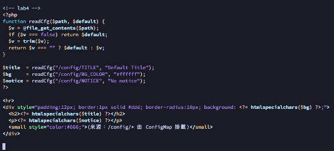

### 1.2 Build & Push Image

```bash
docker build -t k8slab:lab4 .
docker tag k8slab:lab4 {repo}:lab4
docker push {repo}:lab4
```

> 將 `{repo}` 替換為你的 Docker Hub repository 名稱。

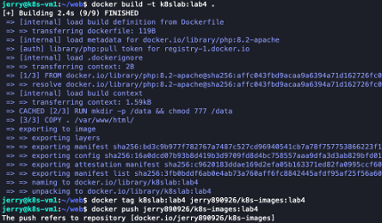

---

## Part 2 - 部署 ConfigMap

### 2.1 建立並部署 YAML

```bash
mkdir lab4 && cd lab4

vim lab4-deploy.yaml
vim lab4-svc.yaml
vim lab4-config.yaml

kubectl apply -f lab4-deploy.yaml
kubectl apply -f lab4-svc.yaml
kubectl apply -f lab4-config.yaml
```

### [lab4-deploy.yaml](yaml/lab4-deploy.yaml)

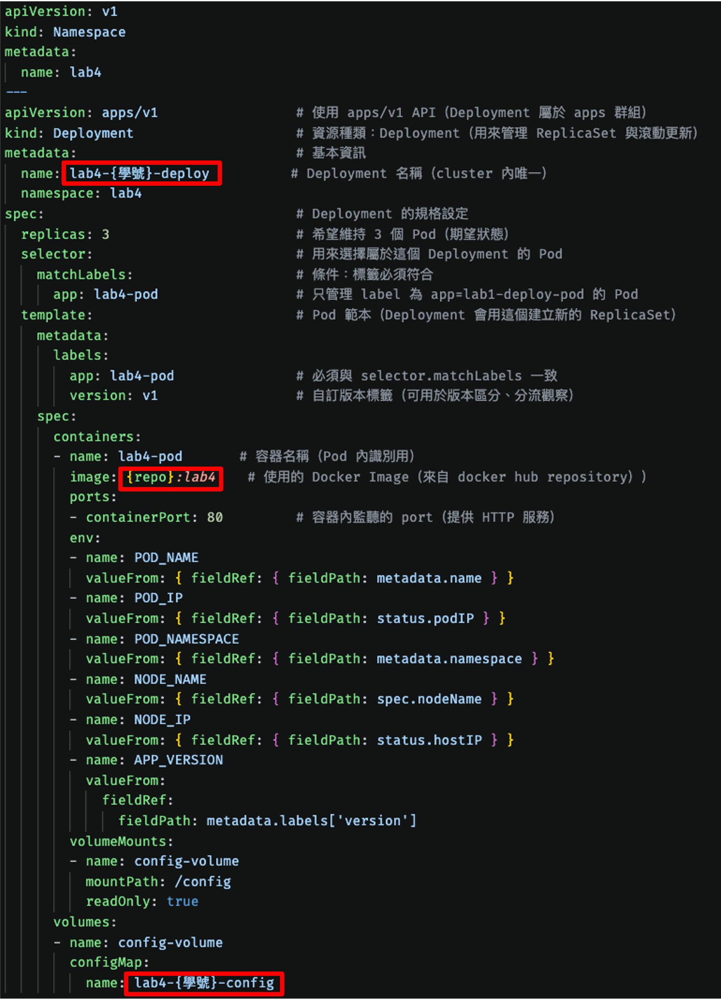

### [lab4-svc.yaml](yaml/lab4-svc.yaml)

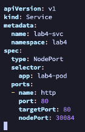

### [lab4-config.yaml](yaml/lab4-config.yaml)

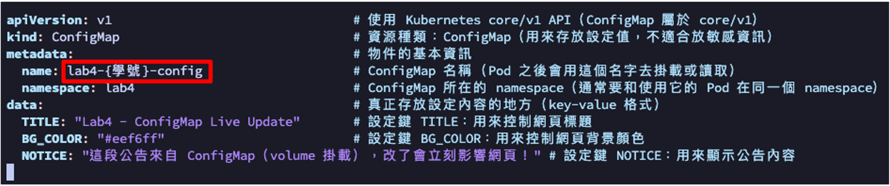

### 2.2 編輯 ConfigMap

瀏覽器開啟：`http://{masterip}:30084`

```bash
kubectl edit configmap lab4-{學號}-config -n lab4
```

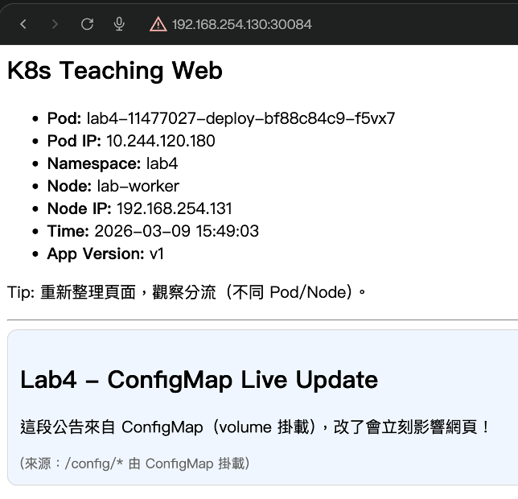

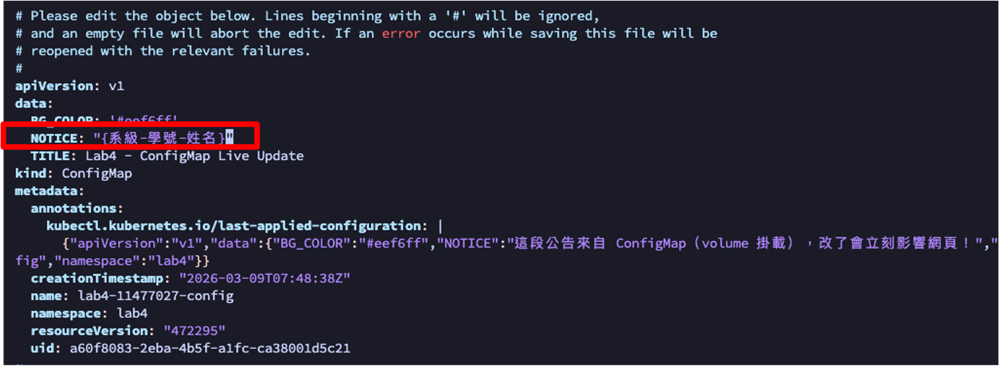

### 2.3 驗證 ConfigMap 即時更新

瀏覽器開啟：`http://{masterip}:30084`，將 ConfigMap 內容改為自己的系級學號姓名。

> **截圖一**（將 config 更改為自己的系級學號姓名）

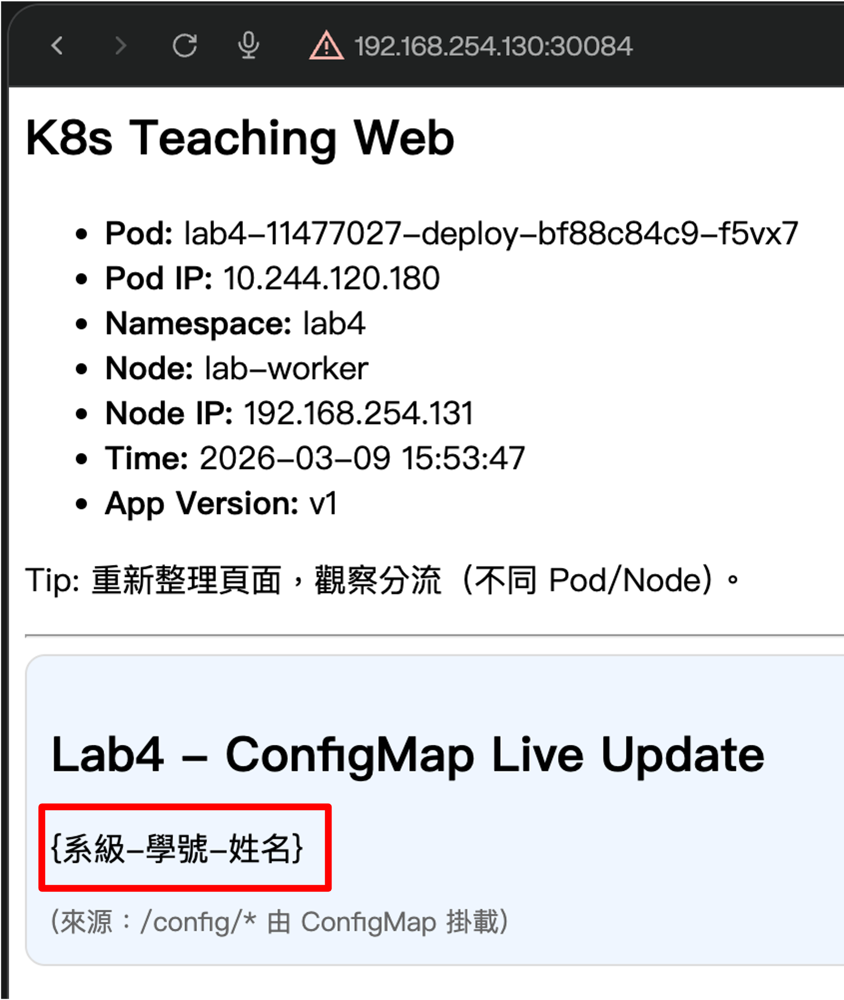

---

## Part 3 - 部署 Pod on Master node

### 3.1 為節點貼標籤

```bash
kubectl get nodes
kubectl label node k8s-vm1 role=control
kubectl label node k8s-vm2 role=compute
kubectl get nodes --show-labels
```

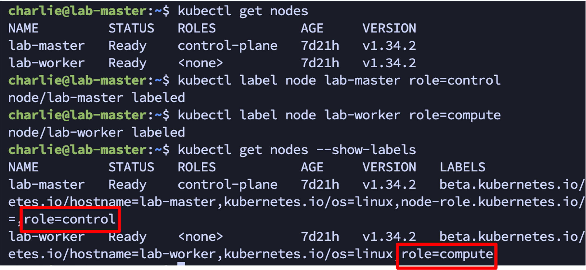

### 3.2 使用 nodeSelector 部署到 compute 節點

```bash
vim lab4-nodeselector.yaml
kubectl apply -f lab4-nodeselector.yaml
kubectl get pod -n lab4 -o wide
```

### [lab4-nodeselector.yaml](yaml/lab4-nodeselector.yaml)

此時 `nodeSelector.role: compute`，Pod 會排到 worker 節點。

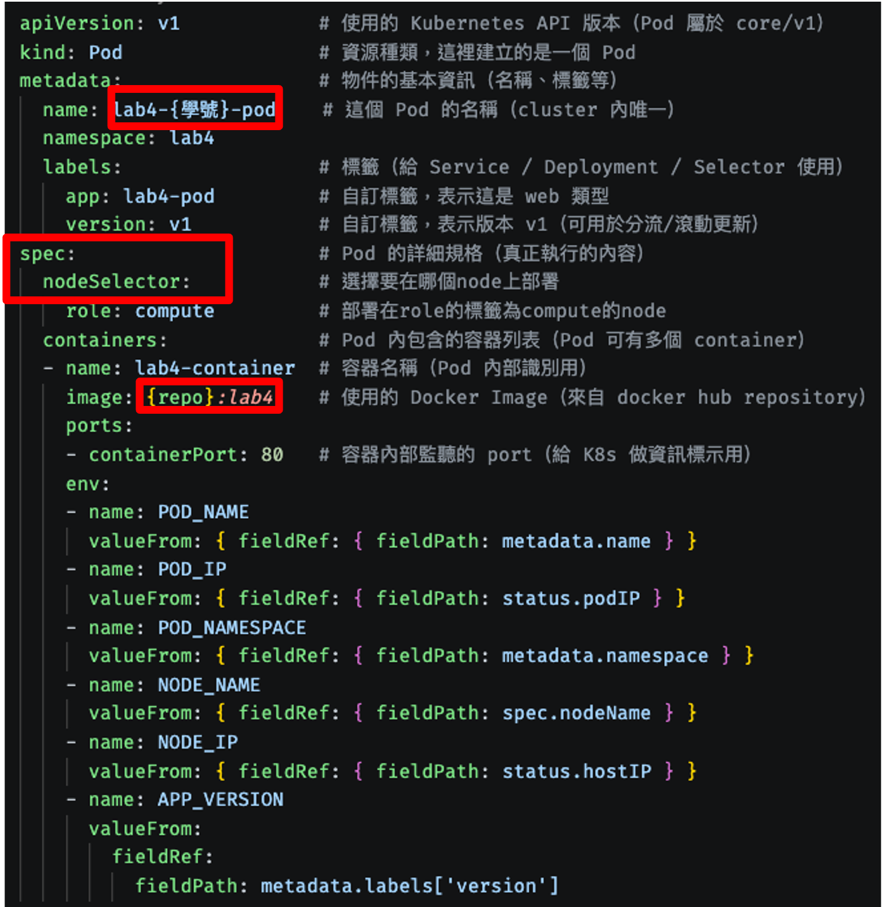

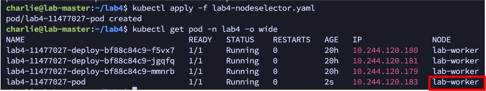

### 3.3 改部署到 control 節點（觀察 Pending）

```bash
kubectl delete -f lab4-nodeselector.yaml
vim lab4-nodeselector.yaml
kubectl apply -f lab4-nodeselector.yaml
kubectl get pod -n lab4
kubectl describe pod lab4-{學號}-pod -n lab4
```

將 [lab4-nodeselector.yaml](yaml/lab4-nodeselector.yaml) 的 `nodeSelector.role` 改成 `control`。由於 control-plane 節點預設帶有 taint，Pod 會停在 `Pending`；`describe` 可看到 `untolerated taint` 與 `didn't match Pod's node affinity/selector`。

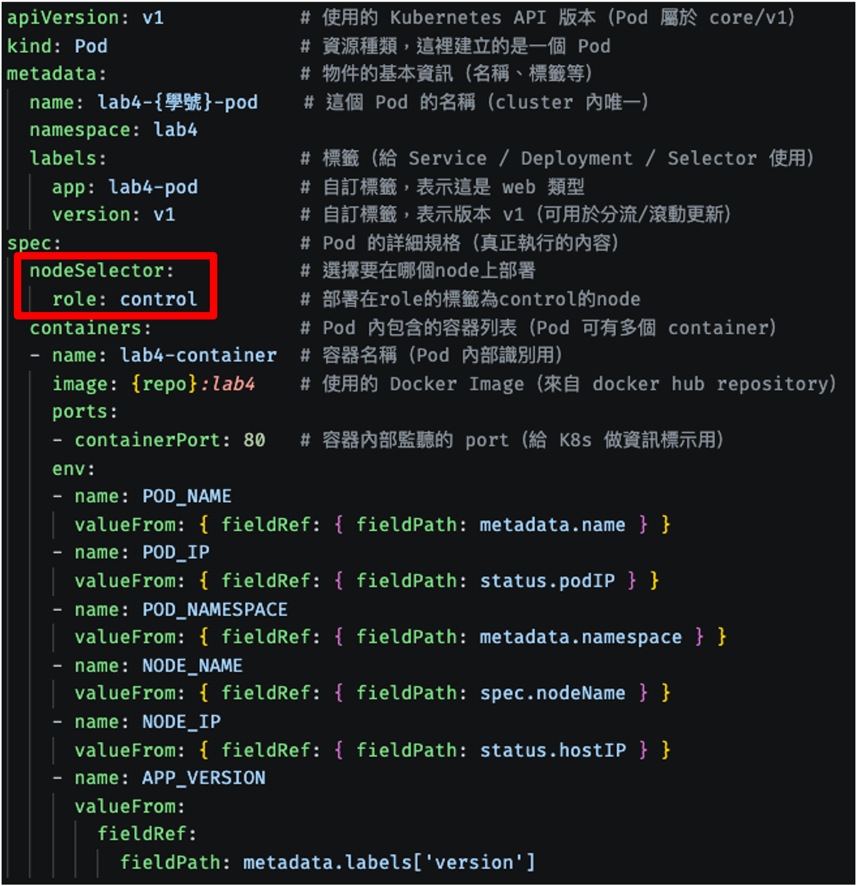

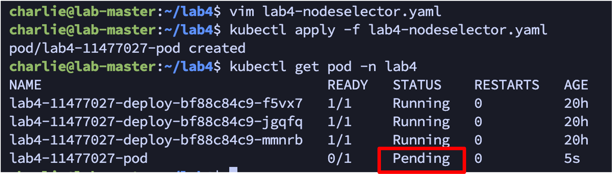

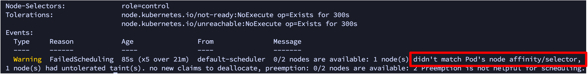

### 3.4 加上 toleration 部署到 master 節點

```bash
kubectl delete -f lab4-nodeselector.yaml
vim lab4-nodeselector.yaml
kubectl apply -f lab4-nodeselector.yaml
kubectl get pod -n lab4 -o wide
```

在 [lab4-nodeselector.yaml](yaml/lab4-nodeselector.yaml) 的 `spec:` 底下（與 `nodeSelector`、`containers` 同一層）加入以下 `tolerations`，讓 Pod 能容忍 control-plane 節點的 taint：

```yaml
  tolerations:                                   # 容忍（tolerate）某些節點的 taint，否則 Pod 不能被排上去
  - key: "node-role.kubernetes.io/control-plane" # 要容忍的 taint key（control-plane 節點常見）
    operator: "Exists"                           # 只要有這個 key 就容忍，不需要指定 value
    effect: "NoSchedule"                         # 容忍 NoSchedule taint，允許 Pod 被排到該節點
```

加入後重新套用，Pod 即可成功排程到 master 節點（`NODE` 顯示 `lab-master`）。

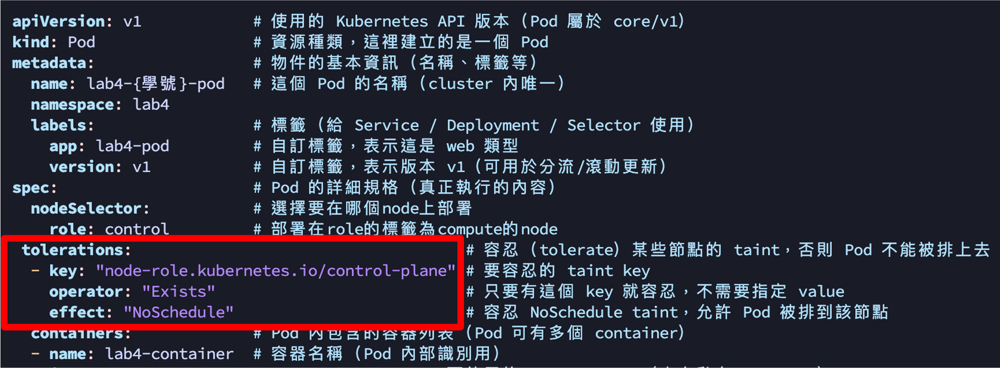

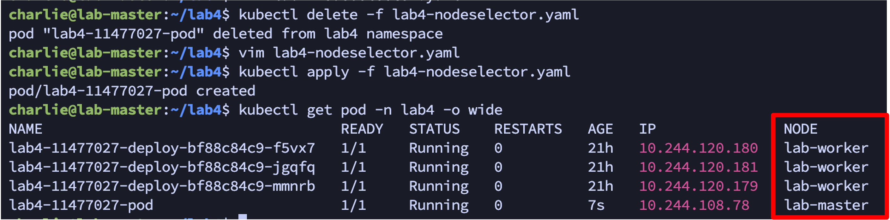

### 3.5 驗證 Pod 部署在 master 節點

瀏覽器開啟：`http://{masterip}:30084`

> **截圖二**（要看到 Node 顯示為 master 節點）

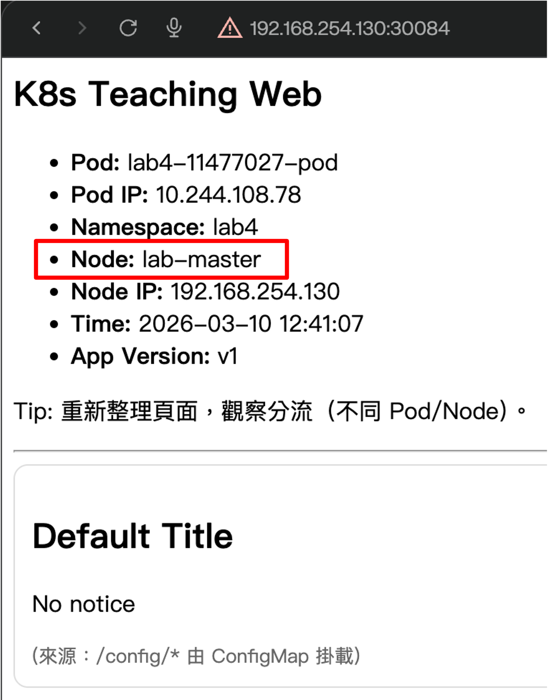
