# Lab6 Gateway
---

## 一、Build image

### 1. 修改 [`index.php`](index.php)

接續之前的檔案，於下方新增 Lab6 的內容，會根據 `APP_VERSION` 顯示不同背景色並印出 Gateway 收到的路徑。

```bash
cd web
vim index.php
```

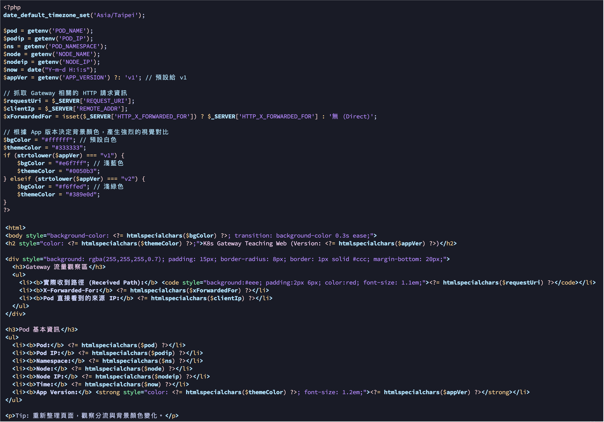

### 2. Build & Push image

```bash
docker build -t k8slab:lab6 .
docker tag k8slab:lab6 {repo}:lab6
docker push {repo}/k8slab:lab6
```

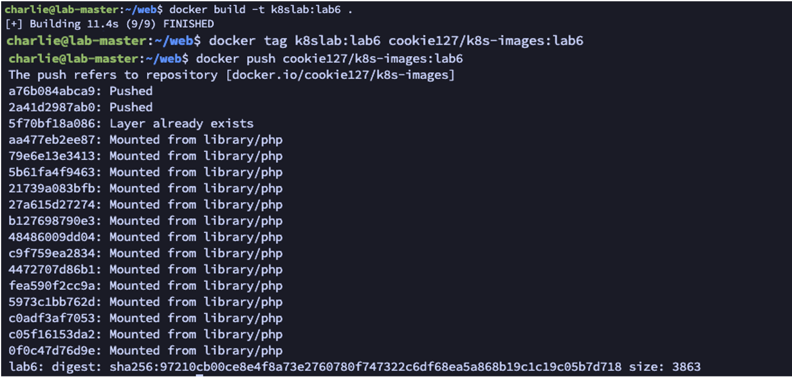

---

## 二、安裝 Gateway

### 1. 安裝 Gateway API CRD 與 Envoy Gateway

```bash
kubectl apply -f https://github.com/kubernetes-sigs/gateway-api/releases/download/v1.0.0/standard-install.yaml
kubectl apply --server-side -f https://github.com/envoyproxy/gateway/releases/download/v1.6.3/install.yaml

kubectl -n envoy-gateway-system get pods -w   # 等 pod running 再進行下一步
```

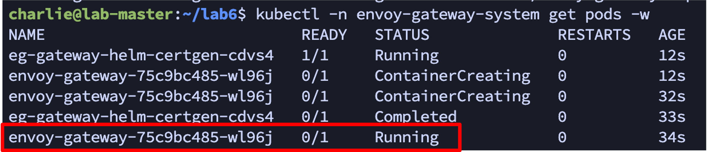

### 2. 建立 GatewayClass

```bash
mkdir lab6
cd lab6
vim eg-gatewayclass.yaml

kubectl apply -f eg-gatewayclass.yaml
kubectl get gatewayclass
```

對應的 YAML 檔案：[`eg-gatewayclass.yaml`](yaml/eg-gatewayclass.yaml)

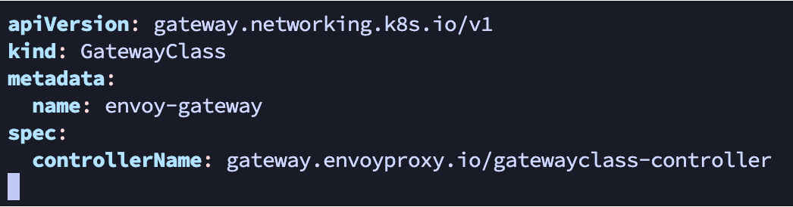
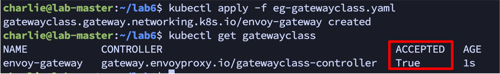

---

## 三、部署 Gateway

### 1. 部署 Deployment 與 Service

```bash
vim lab6-deploy.yaml
kubectl apply -f lab6-deploy.yaml

vim lab6-svc.yaml
kubectl apply -f lab6-svc.yaml
```

對應的 YAML 檔案：

- [`lab6-deploy.yaml`](yaml/lab6-deploy.yaml)（v1 / v2 兩組 Deployment,各 3 replicas,帶 `APP_VERSION` 環境變數）
- [`lab6-svc.yaml`](yaml/lab6-svc.yaml)（`lab6-v1-svc` / `lab6-v2-svc` 兩個 ClusterIP Service）

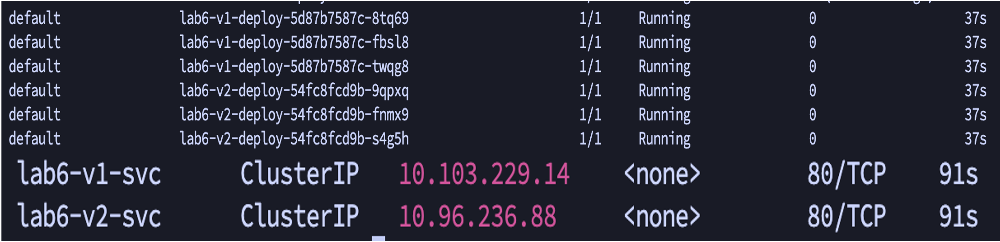

### 2. 部署 Gateway 與 Path Routing

```bash
vim lab6-gateway.yaml
kubectl apply -f lab6-gateway.yaml

kubectl get pod -n envoy-gateway-system
kubectl get svc -n envoy-gateway-system   # 確認 svc 有 EXTERNAL-IP 再進行下一步

vim lab6-pathrouting.yaml
kubectl apply -f lab6-pathrouting.yaml
```

對應的 YAML 檔案:

- [`lab6-gateway.yaml`](yaml/lab6-gateway.yaml)（listener HTTP:80）
- [`lab6-pathrouting.yaml`](yaml/lab6-pathrouting.yaml)（`/v1` → v1-svc、`/v2` → v2-svc,帶 URL Rewrite）

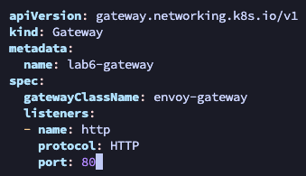
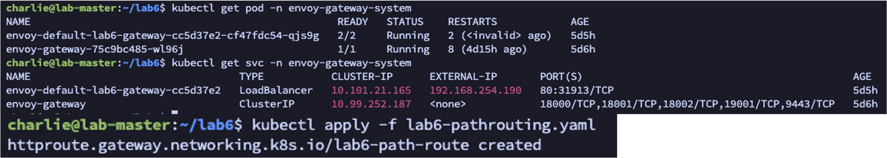

### 3. Localhost web 驗證

```
http://{loadbalancer ip}/v1
http://{loadbalancer ip}/v2
```

> **截圖一**：網址正確導入 V1 流量（淺藍底）

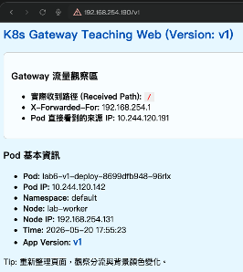

> **截圖二**：網址正確導入 V2 流量（淺綠底）

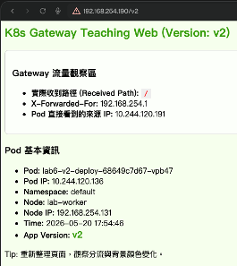

---

## 四、Redirect & Rewrite

### 1. 套用 Redirect / Rewrite

```bash
vim lab6-redirect.yaml
vim lab6-rewrite.yaml

kubectl apply -f lab6-redirect.yaml
kubectl apply -f lab6-rewrite.yaml
kubectl apply -f lab6-pathrouting.yaml

kubectl get httproute
```

對應的 YAML 檔案：

- [`lab6-redirect.yaml`](yaml/lab6-redirect.yaml)（`/old-web` → 301 redirect）
- [`lab6-rewrite.yaml`](yaml/lab6-rewrite.yaml)（`/api/v2` → 重寫成 `/` 再打到 v2-svc）

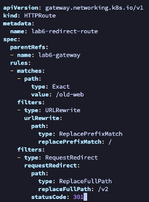
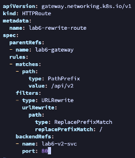

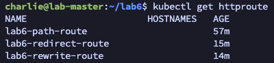

### 2. Localhost web 驗證

```
http://{loadbalancer ip}/old-web
http://{loadbalancer ip}/api/v2
```

> **截圖一**：`/old-web` 被 redirect

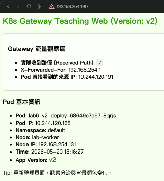

> **截圖二**：`/api/v2` 被 rewrite 後打到 V2 服務

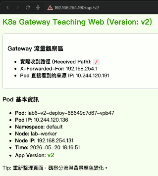

---

## 五、Weight-split

### 1. 套用 Weight-split

```bash
vim lab6-weight-split.yaml
kubectl apply -f lab6-weight-split.yaml
```

[`lab6-weight-split.yaml`](yaml/lab6-weight-split.yaml)

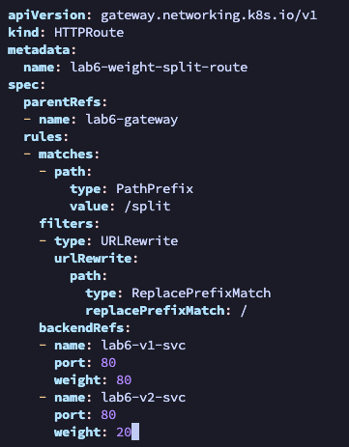

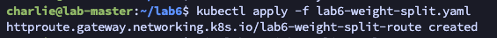

### 2. Localhost web 驗證

```
http://{loadbalancer ip}/split
```

> **截圖三**：`/split` 路徑導入 V1 服務

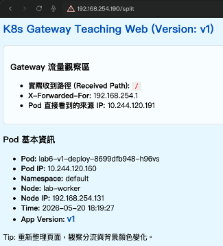

> **截圖四**：刷新網頁,`/split` 路徑導入 V2 服務

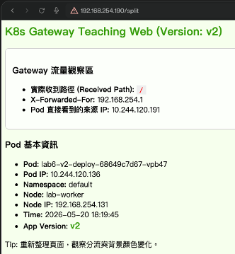
