# lab project

## 目錄

- [Install tools](#install-tools)
- [Build image](#build-image)
- [All in one application](#all-in-one-application)
- [Application decoupling](#application-decoupling)
- [建立 dev pod](#建立-dev-pod)
- [部署 web](#部署-web)
- [資料遷移](#資料遷移)
- [套上 NetworkPolicy 鎖定 DB](#套上-networkpolicy-鎖定-db)
- [建立 HPA](#建立-hpa)
- [負載壓力測試](#負載壓力測試)

---

## 架構概覽

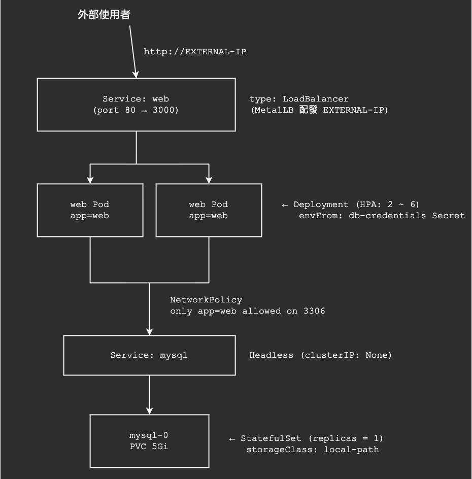

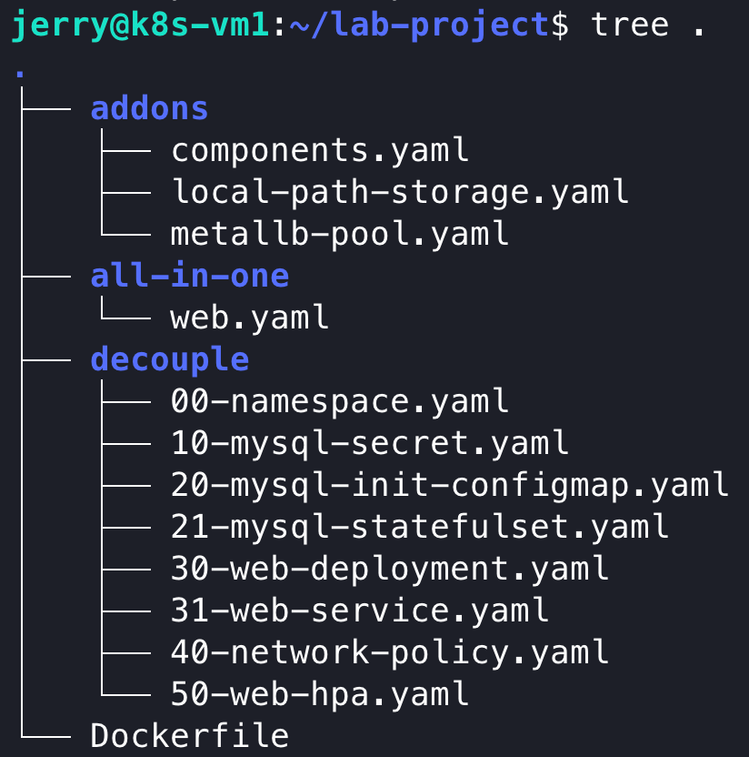

---

## Install tools

### Step 1：建立路徑

Command:

```bash
mkdir lab-project
cd lab-project
mkdir addons
```

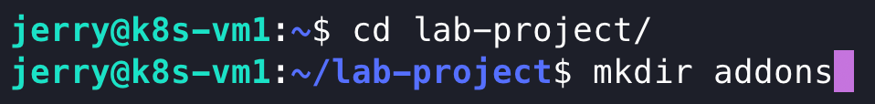

### Step 2：安裝 metrics-server（lab5）

**相關檔案**：[`addons/components.yaml`](addons/components.yaml)

Command:

```bash
# lab5
vim addons/components.yaml
kubectl apply -f addons/components.yaml
kubectl top nodes
```

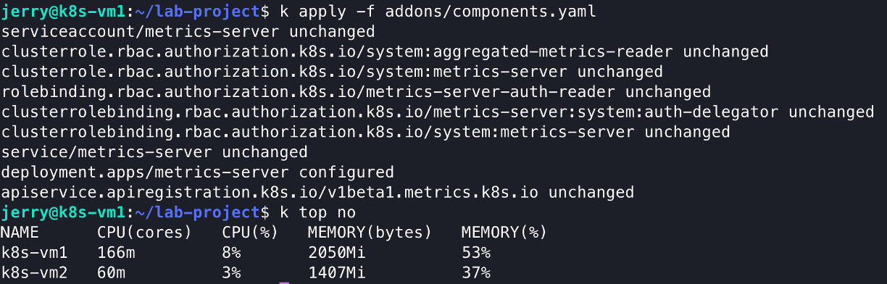

### Step 3：安裝 local-path storage（lab3）

**相關檔案**：[`addons/local-path-storage.yaml`](addons/local-path-storage.yaml)

Command:

```bash
# lab3
vim addons/local-path-storage.yaml
kubectl apply -f addons/local-path-storage.yaml
kubectl get sc
```

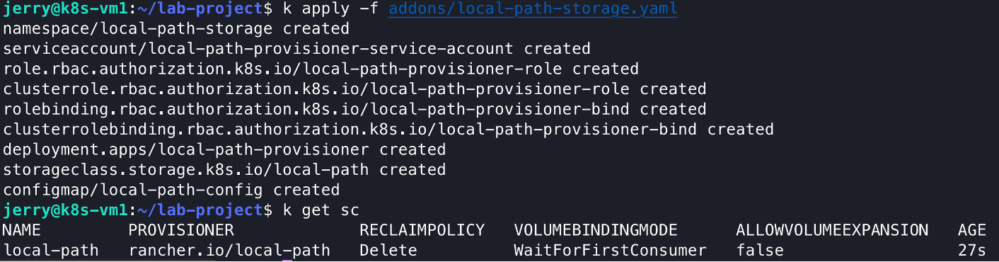

### Step 4：安裝 MetalLB（lab2）

Command:

```bash
# 安裝 MetalLb (Lab2)
kubectl apply -f https://raw.githubusercontent.com/metallb/metallb/v0.13.12/config/manifests/metallb-native.yaml

# 等到所有 pod 都 Running 且 READY
kubectl -n metallb-system get pods -w
```

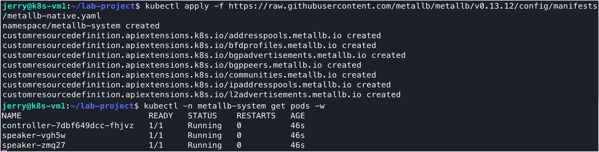

### Step 5：編輯 MetalLB IP Pool

**相關檔案**：[`addons/metallb-pool.yaml`](addons/metallb-pool.yaml)

Command:

```bash
vim addons/metallb-pool.yaml
```

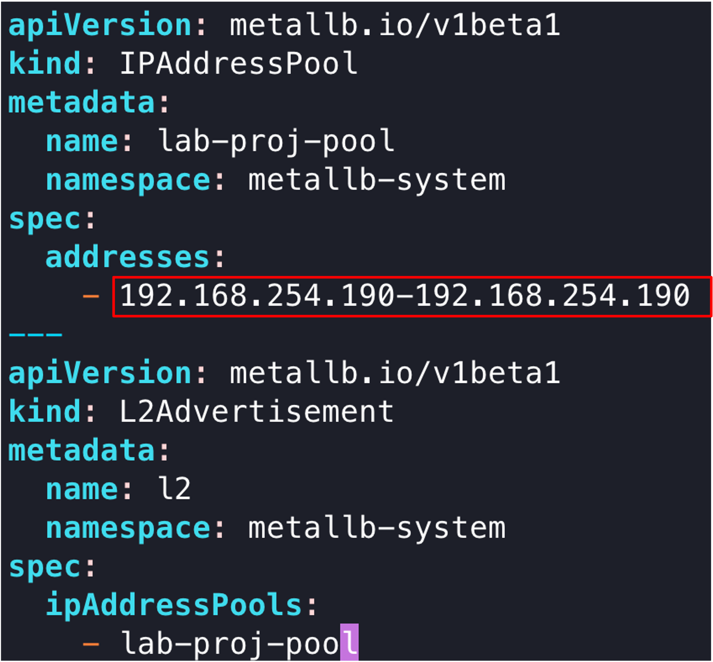

### Step 6：套用 MetalLB IP Pool

**相關檔案**：[`addons/metallb-pool.yaml`](addons/metallb-pool.yaml)

Command:

```bash
kubectl apply -f addons/metallb-pool.yaml
```

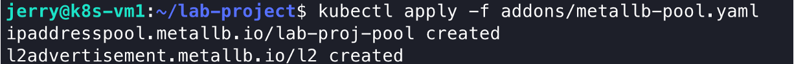

---

## Build image

**相關檔案**：[`Dockerfile`](Dockerfile)

```bash
docker build -t students-web:v1 .
docker tag students-web:v1 {repo}:lab-project
docker push {repo}:lab-project
```

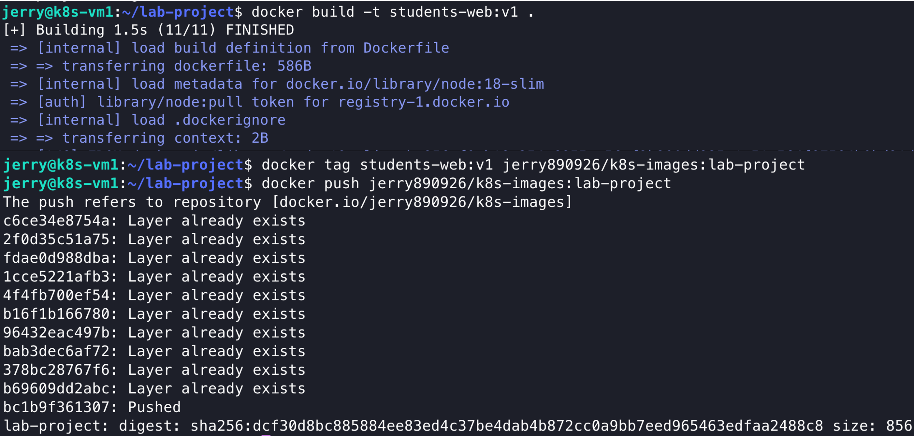

---

## All in one application

### 部署 web

**相關檔案**：[`all-in-one/web.yaml`](all-in-one/web.yaml)

Command:

```bash
vim all-in-one/web.yaml
kubectl apply -f all-in-one/web.yaml
kubectl get svc -n students
```

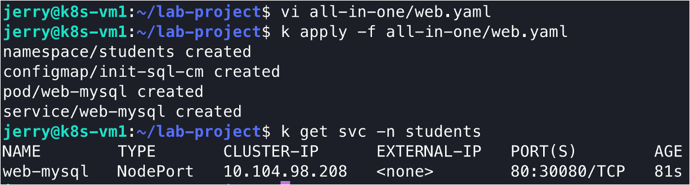

### 連線 localhost web

```
http://{master_IP}:30080
```

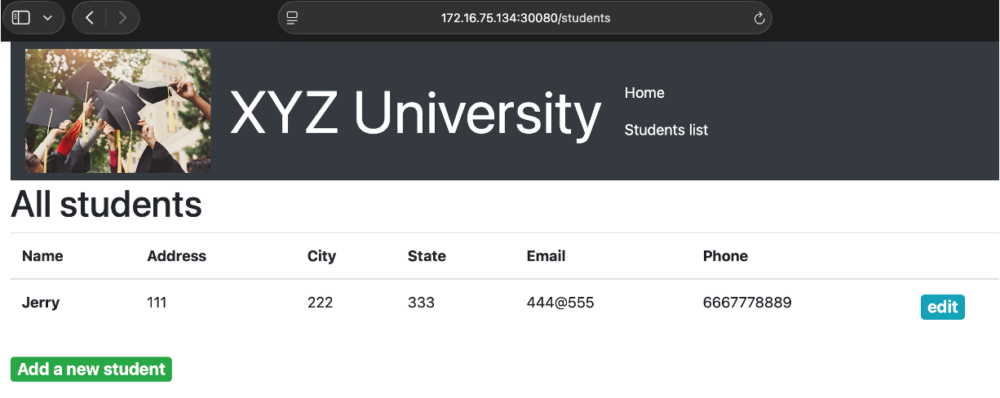

---

## Application decoupling

設計目標：

- `mysql` 拆出 Pod → 獨立 **StatefulSet**
- DB 憑證 → **Secret**
- `web` → **Deployment**
- `mysql` Pod 只允許來自 `app=web` 的 3306 流量
- `web` Pod 對外允許所有 LB（讓 Load-Balancer 進入），對內只能訪問 mysql 與 DNS

### Step 1：建立 Namespace、Secret、ConfigMap 與 mysql StatefulSet

**相關檔案**：

- [`decouple/00-namespace.yaml`](decouple/00-namespace.yaml)
- [`decouple/10-mysql-secret.yaml`](decouple/10-mysql-secret.yaml)
- [`decouple/20-mysql-init-configmap.yaml`](decouple/20-mysql-init-configmap.yaml)
- [`decouple/21-mysql-statefulset.yaml`](decouple/21-mysql-statefulset.yaml)

Command:

```bash
vim decouple/00-namespace.yaml
vim decouple/10-mysql-secret.yaml
vim decouple/20-mysql-init-configmap.yaml
vim decouple/21-mysql-statefulset.yaml

kubectl apply -f decouple/00-namespace.yaml
kubectl apply -f decouple/10-mysql-secret.yaml
kubectl apply -f decouple/20-mysql-init-configmap.yaml
kubectl apply -f decouple/21-mysql-statefulset.yaml
```

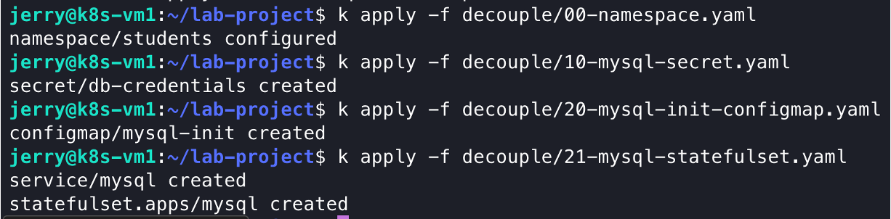

### Step 2：確認 mysql Pod 與 PVC

Command:

```bash
kubectl -n students get pod mysql-0
kubectl -n students get pvc
```

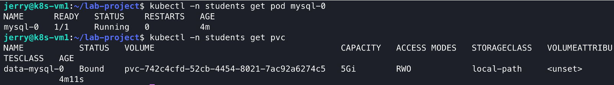

---

## 建立 dev pod

Command:

```bash
kubectl -n students run dev --image=mysql:8.0 --restart=Never -- sleep infinity

kubectl -n students wait --for=condition=Ready pod/dev

kubectl -n students exec -it dev -- bash -c \
  'mysql -h mysql -u nodeapp -pstudent12 -e "show databases; use STUDENTS; show tables;"'
```

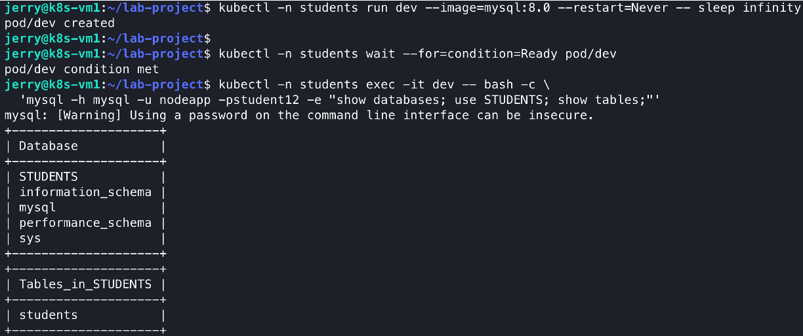

---

## 部署 web

### Step 1：撰寫 Deployment 與 Service

**相關檔案**：

- [`decouple/30-web-deployment.yaml`](decouple/30-web-deployment.yaml)
- [`decouple/31-web-service.yaml`](decouple/31-web-service.yaml)

Command:

```bash
vim decouple/30-web-deployment.yaml
vim decouple/31-web-service.yaml
```

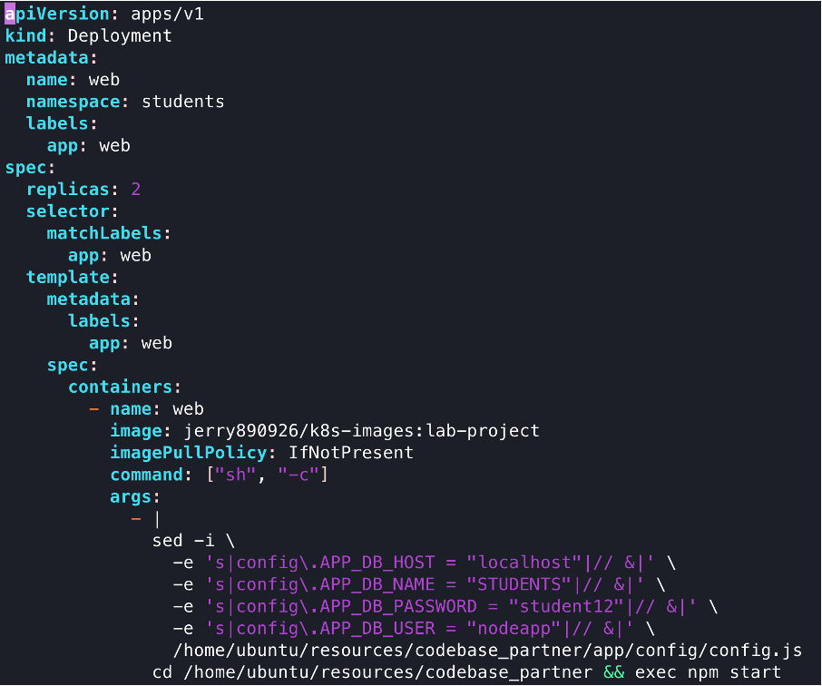

### Step 2：套用 Deployment 與 Service

**相關檔案**：

- [`decouple/30-web-deployment.yaml`](decouple/30-web-deployment.yaml)
- [`decouple/31-web-service.yaml`](decouple/31-web-service.yaml)

Command:

```bash
kubectl apply -f decouple/30-web-deployment.yaml
kubectl apply -f decouple/31-web-service.yaml
```

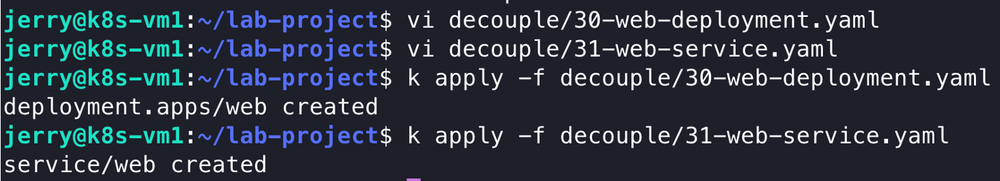

### Step 3：驗證 web Pod 與環境變數

Command:

```bash
kubectl -n students get pod -l app=web
kubectl -n students exec deploy/web -- env | grep APP_DB_
```

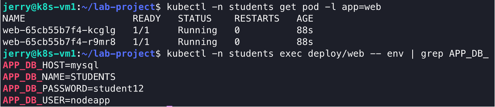

---

## 資料遷移

學生資料從 **all-in-one** 的 web pod 資料庫 dump 到 **decoupling** 後的 mysql pod。

Command:

```bash
# 從 all-in-one 的 web-mysql Pod 匯出
kubectl -n students exec web-mysql -c mysql -- \
  mysqldump -u nodeapp -pstudent12 --databases STUDENTS > /tmp/data.sql

# 透過 dev pod 匯入到 StatefulSet
kubectl -n students cp /tmp/data.sql dev:/tmp/data.sql
kubectl -n students exec -i dev -- mysql -h mysql -u nodeapp -pstudent12 < /tmp/data.sql

# 驗證（COUNT > 0）
kubectl -n students exec dev -- \
  mysql -h mysql -u nodeapp -pstudent12 STUDENTS \
  -e "SELECT COUNT(*) AS cnt FROM students; SELECT * FROM students LIMIT 5;"
```

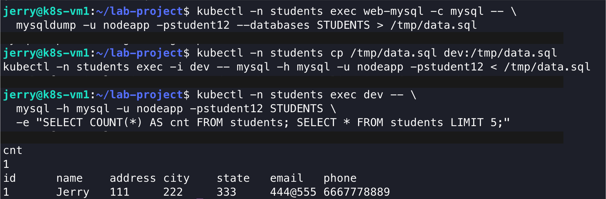

### 取得 web Service 的 EXTERNAL-IP

Command:

```bash
kubectl -n students get svc web
```

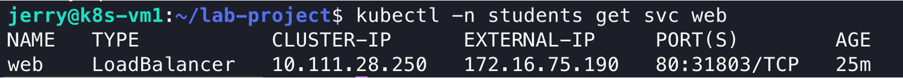

### 從外部存取 web

```
http://{EXTERNAL-IP}
```

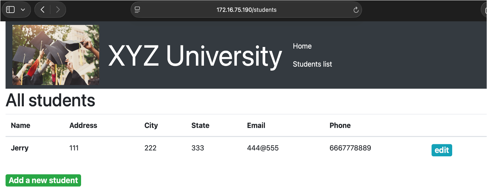

---

## 套上 NetworkPolicy 鎖定 DB

### Step 1：套用 NetworkPolicy

**相關檔案**：[`decouple/40-network-policy.yaml`](decouple/40-network-policy.yaml)

Command:

```bash
vi decouple/40-network-policy.yaml
kubectl apply -f decouple/40-network-policy.yaml
```

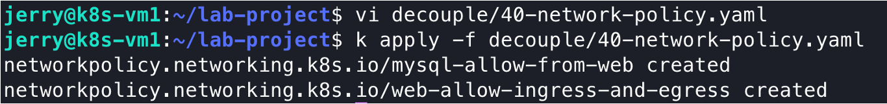

### Step 2：驗證 NetworkPolicy 生效

```bash
# web Pod 仍能正常存取（CRUD 不受影響）
curl -s http://EXTERNAL-IP/students | head

# dev Pod（沒有 app=web label）應被擋掉
kubectl -n students exec dev -- \
  mysql -h mysql -u nodeapp -pstudent12 --connect-timeout=5 -e "SELECT 1;" 2>&1 \
  | grep -E "(timed out|Can't connect)" && echo "OK: NetworkPolicy 生效"
```

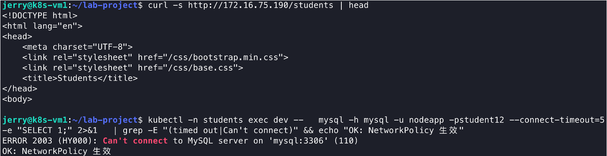

---

## 建立 HPA

**相關檔案**：[`decouple/50-web-hpa.yaml`](decouple/50-web-hpa.yaml)

Command:

```bash
vi decouple/50-web-hpa.yaml
kubectl apply -f decouple/50-web-hpa.yaml
kubectl -n students get hpa
```

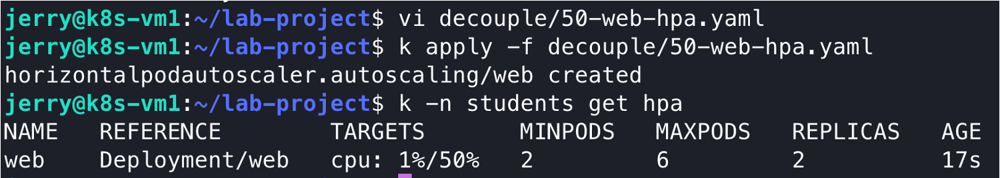

---

## 負載壓力測試

### Step 1：使用 ab 進行壓測

Command:

```bash
sudo apt-get install -y apache2-utils

EXTERNAL_IP=$(kubectl -n students get svc web \
  -o jsonpath='{.status.loadBalancer.ingress[0].ip}')

ab -n 200000 -c 500 -k http://$EXTERNAL_IP/
```

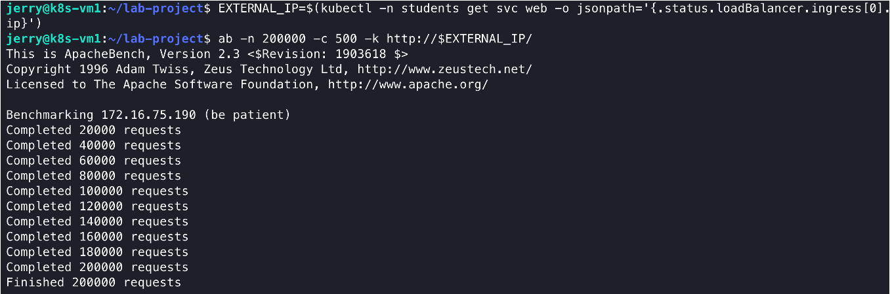

### Step 2：開啟兩個 terminal 觀察 HPA 縮放

Command:

```bash
kubectl -n students get pods -l app=web -w
```

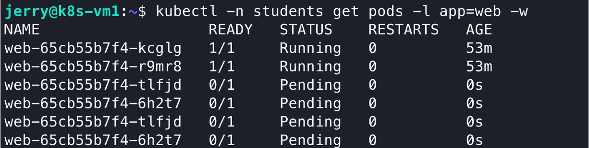

```bash
kubectl -n students get hpa -w
```

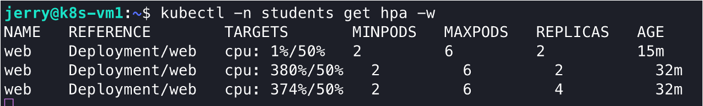
